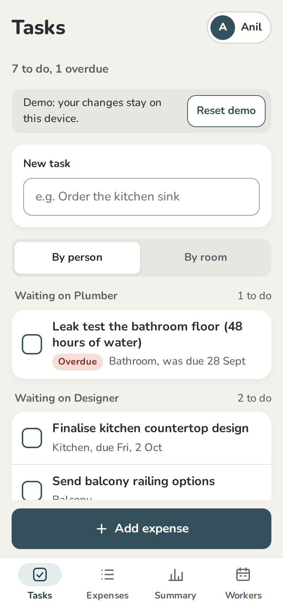
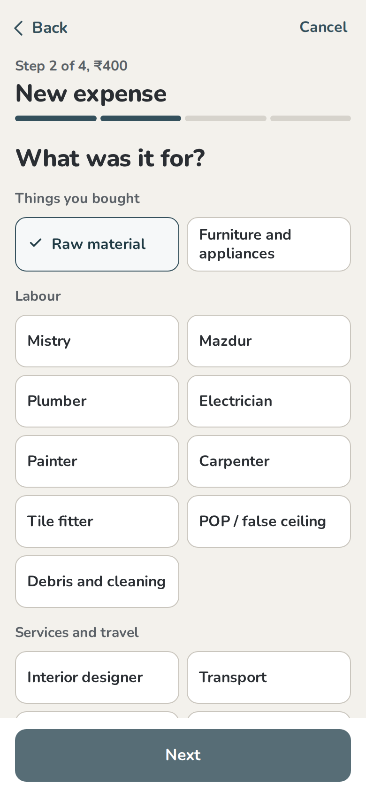
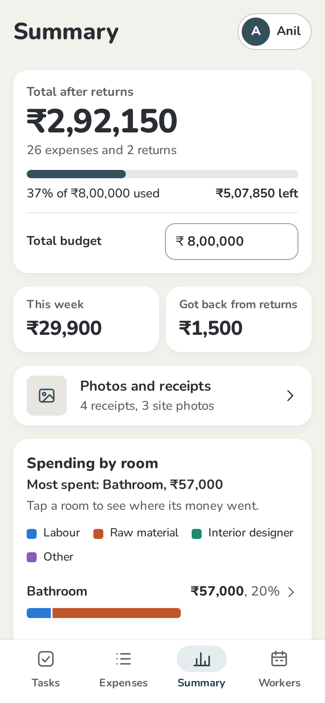
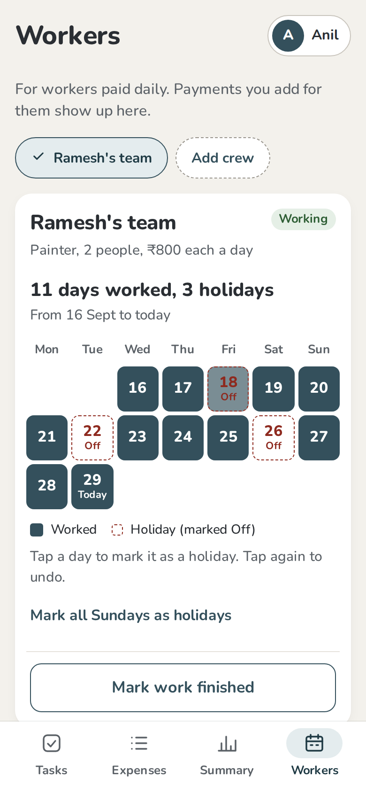
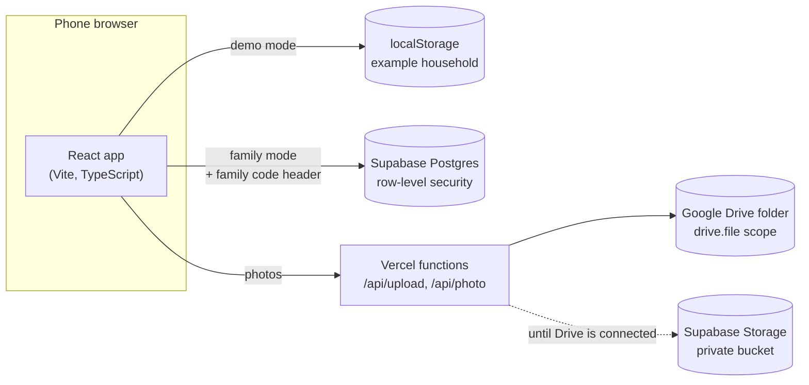

# Renovation tracker

A mobile-first web app that helps a family run a home renovation: what's pending and who it's waiting on, where the money went room by room, what was returned, and what the daily-wage crews are still owed.

It was designed to be usable by the least confident person in the family: one question per screen, big targets, plain words, and an in-app text size setting.

**Live demo:** _add your Vercel demo URL here_. It needs no sign-up; the demo keeps an example household in your browser.
**Case study:** [docs/case-study.md](docs/case-study.md), covering how the design evolved and why.

<p>
  
  
  
  
</p>

## The problem

During a renovation, money leaves in small pieces:
- a mistry paid in cash,
- tiles on UPI,
- a sanitaryware bill with one item returned,
- painters paid by the day,
- designer fees that belong to no single room.

A spreadsheet can hold all of it, but nobody opens a spreadsheet on a phone at a hardware shop. The question at the end of the day is simple, **which room is eating the budget, and on what?**, but answering it depends on data being entered consistently by several people.

## What it does

- **Tasks (home screen):** a checklist of what's pending, grouped by who it's waiting on (Plumber, Designer, a family member) or by room. Overdue tasks come first.
- **Add an expense, one question at a time:** amount → what for → material or crew → room → date → check and save.
  - Every line on the check screen has a **Change** button.
  - Indian digit grouping (1,25,000) as you type.
- **Returns linked to the bill:** a return comes off the original purchase and inherits its room and category, so the totals stay right. **Add replacement** pre-fills the next purchase.
- **Summary:**
  - Total after returns and a budget meter.
  - Spending by room as stacked bars split into Labour / Raw material / Interior designer / Other, with shared "Whole house" costs shown separately.
  - A drill-down for each room and spending each week.
- **Workers:** attendance for daily-wage crews.
  - Tap a day to mark a holiday, and mark work finished when it ends.
  - Earned vs paid vs still to pay.
  - Payments come only from Expenses: one active crew links automatically, and it asks only when two crews overlap.
- **Photos and receipts:** attach a receipt photo to any expense, or add site photos. Stored in a family Google Drive folder, or in private Supabase Storage.
- **No sign-in, full history:** pick your name on opening, and every add, edit, delete and restore records who did it and when. Deletes go to **Recently deleted**, and everything can be undone.

## Design principles

- **Design for the least confident user.** Large targets (44–64 px), one decision per screen, no auto-advance, and a check mark on every selected option so colour is never the only signal.
- **Analytics start at data entry.** Material types instead of free text, returns linked to bills, crews linked to payments, and a shared-costs bucket keep the numbers honest without extra work.
- **Calm by default.**
  - Nunito, charcoal text on a warm stone background, and one slate-teal accent.
  - Every text colour pair is at least 5:1 contrast.
  - Chart colours checked for colour-blind separation.
- The design was audited against [taste-skill](https://github.com/Leonxlnx/taste-skill) and an [Apple Human Interface Guidelines skill](https://github.com/dickwu/apple-design-skill). The findings and decisions are in [design/README.md](design/README.md).

## How it works



- **One codebase, two deployments.** With no database keys it runs as a public demo: local data, fictional household, **Reset demo**, and it never downloads the Supabase client. With keys, it's the shared family app.
- **Access without accounts.** Each device enters a one-time family code. Postgres row-level security checks it on every request, so a wrong code sees nothing and can't write.
- **Phone-native navigation.** Every screen and step is a browser history entry, so Android's back gesture goes back one step. Finishing a flow removes its steps from history.
- **No UI or chart library.** Plain CSS tokens and HTML bars keep the first load at about 100 KB of gzipped JavaScript. The font is self-hosted.

## Tech stack

React 19 · TypeScript · Vite · Supabase (Postgres, Storage) · Vercel Functions · Google Drive API · Vitest · Playwright

## Run it locally

```bash
npm install
npm run dev     # opens in demo mode, no keys needed
```

| Command | What it does |
|---|---|
| `npm run build` | Type-check and production build |
| `npm test` | Unit tests: returns, crew linking, soft delete, analytics, API functions |
| `npm run smoke` | Browser run through every main flow in demo mode (run after build) |

To deploy the demo or your own family app, see **[docs/SETUP.md](docs/SETUP.md)**.

## Project structure

```
src/
  screens/        Tasks, AddFlow, ReturnFlow, Expenses, Entry, Summary, Media, Workers, Who
  components/     Header, tab bar, choices with check marks, sheet, toast, photo upload
  app/state.tsx   Data, navigation (browser history), flows, undo
  lib/derive.ts   Pure money logic: returns, room and type splits, crews, soft delete
  lib/store/      Demo store (localStorage) and Supabase store behind one interface
api/              Vercel functions: photo upload/view, one-time Google Drive connection
supabase/         schema.sql: tables, family-code row-level security, storage bucket
design/           Clickable design prototype and the design spec
docs/             Setup guide, case study, screenshots
```

## Roadmap

- **Real accounts and multiple households,** to make it a public product. The family code suits one family, not strangers.
- Per-room budgets.
- Splitting a bill across rooms, if "Whole house" hides too much.
- Offline entry, and Hindi labels. The font stack already falls back to Devanagari.
- A proxy for Supabase through the app's own domain, in case an Indian ISP blocks `*.supabase.co` again.

## Credits

Designed and directed by [@thisisgarvit](https://github.com/thisisgarvit), built with Claude as a collaborator. Licensed under [MIT](LICENSE).
